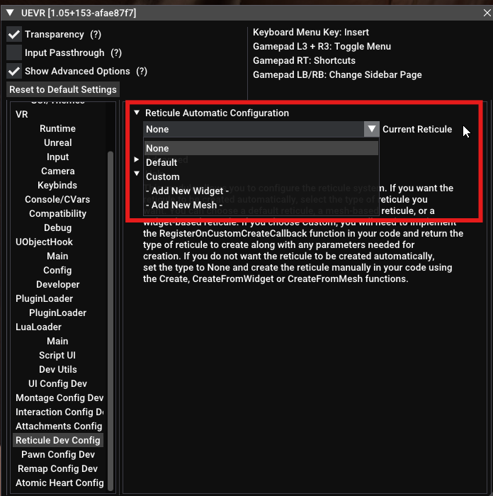
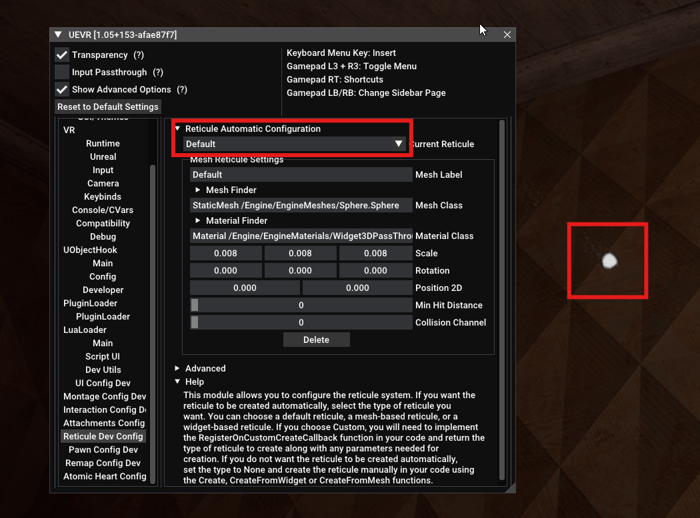
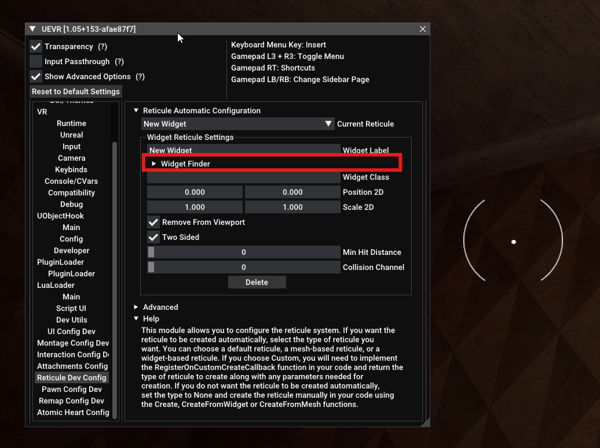
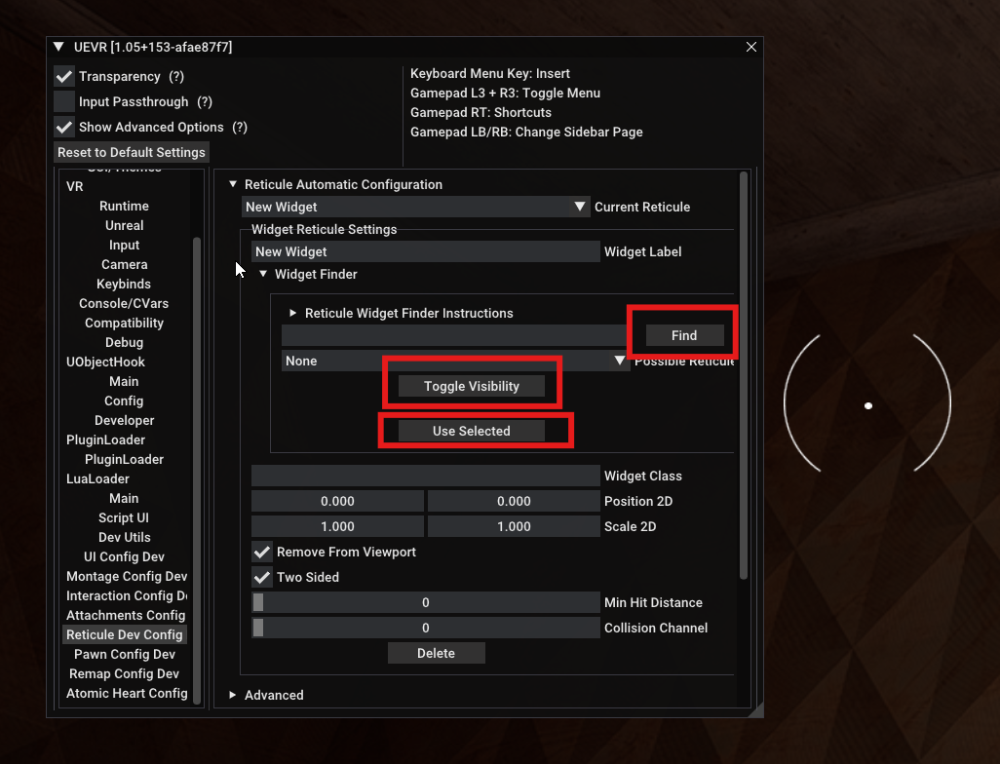
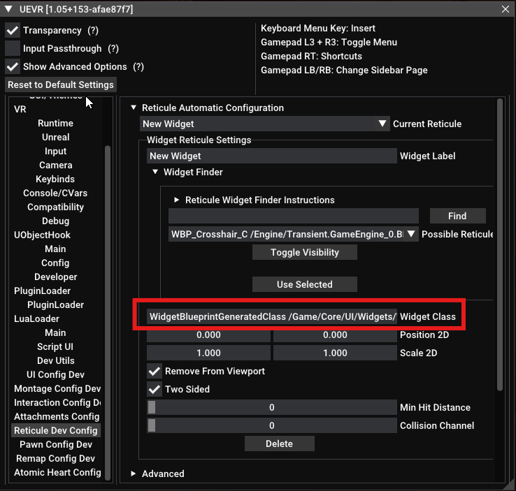
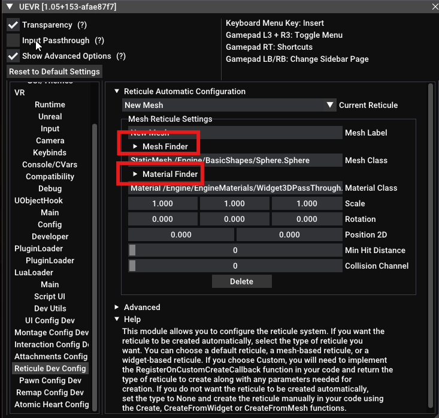
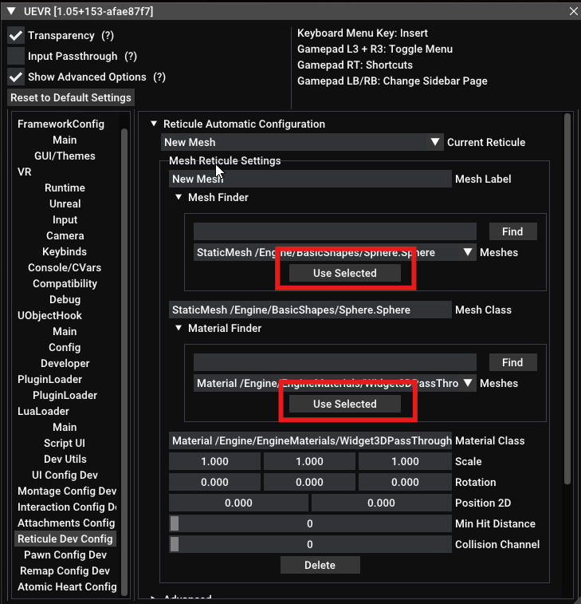
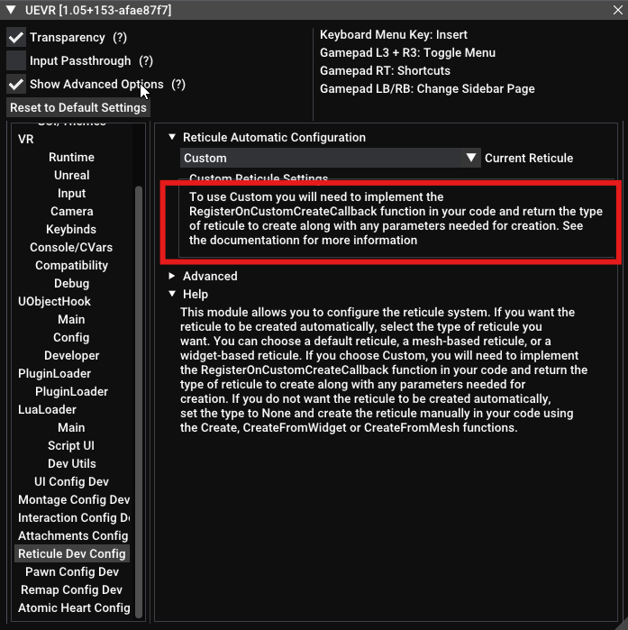
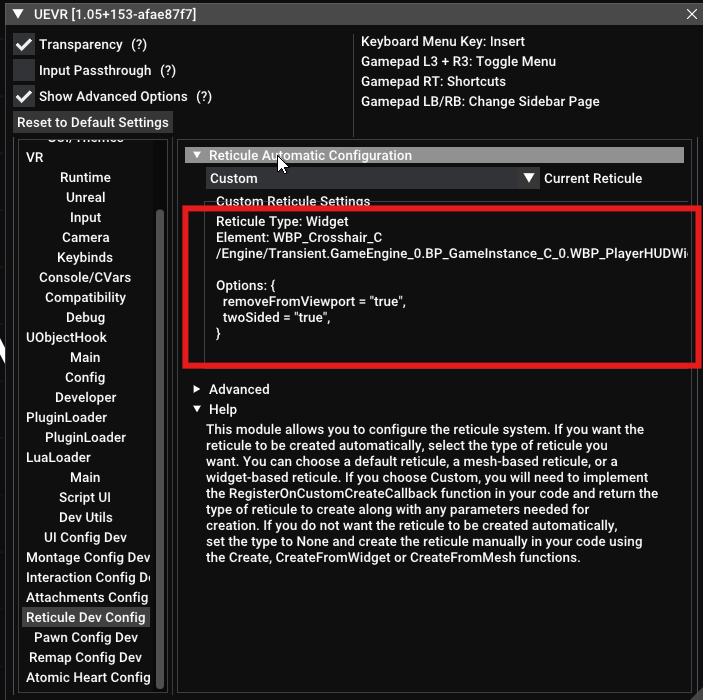
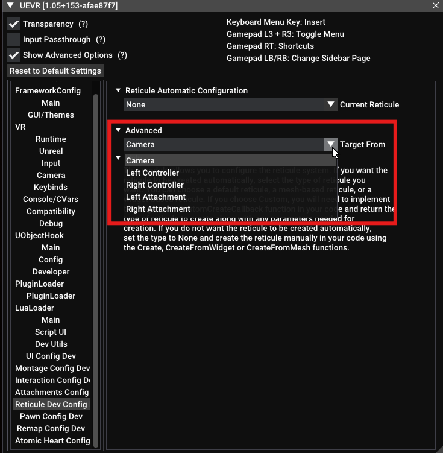

# Reticules

## Using Programmatic Reticule Creation

Rename the file "example_reticule_simple.luax" as "example_reticule_simple.lua" or "example_reticule_advanced.luax" as "example_reticule_advanced.lua" to see examples of how to create reticules programmatically

## Using the Reticule Config Tool
Add the uevrlib libs folder to your scripts folder. Rename example_reticule_wizard.luax to example_reticule_wizard.lua or create a file in your scripts folder with this code
```
local uevrUtils = require('libs/uevr_utils')
local reticule = require("libs/reticule")

uevrUtils.setLogLevel(LogLevel.Debug)
reticule.setLogLevel(LogLevel.Debug)
uevrUtils.setDeveloperMode(true)

reticule.init()
```

> ⚠️ **Notice**  
> The current config tool has been redesigned to be more user friendly. As a consequence the stored data structure had to change. If you used the previous config tool and need to maintain your previous settings use this instead:
> ```lua
> local reticule = require("libs/deprecated/reticule")
> ```


### Interface Overview
The Reticule Config User Interface allows you to create and test various types of reticules interactively and provides the same features as if you were creating reticules programmatically. The end result of using the Interface is that a reticule_parameters.json file is created in the game profile /data folder that stores the information about the reticules you created. After that is done, you can ship your game without Developer Mode set to true. The developer interface will not appear to users of your profile but the reticule library will know the json file exists and will use that to create your reticules at runtime.

Run your game and make sure you are at a point in the game that is appropriate for reticules. For example, the main menu screen wouldn't be a great place to try to create reticules. 

### Current Reticule
You can create and use multiple reticules in your game if you wish. The Current Reticule drop down lets you select, activate and update an existing reticule or add a new reticule of mesh type or widget type.  Mesh type reticules are created from static meshes and can have materials applied to them. Widget type reticules are created from "Class /Script/UMG.Widget"

<br>

### The None Selection
Select None if you dont want the reticule module to automatically create a reticule for you. In that case you can just create reticules programmatically as described in Using Programmatic Reticule Creation

### Default Reticule
The Default reticule is simply a convience reticule that can get you started quickly. It uses a standard mesh and material that "should" be available in any Unreal Engine game. The Scale is also preset to an appropriate size. You can use the Default reticule to quickly see that everything is working correctly with reticules and in some cases this may be all you need to do to have a fully working reticule for your game.

<br>

### Widget Reticules
In the Current Reticule drop down select "- Add New Widget -" to create a widget based reticule. If you happen to know the class of the widget you want to use you can type it directly into the Widget Class text field. However, if you don't already know the class you can use the Widget Finder to help you find the class. Open the tree item that says Widget Finder

<br>

#### The Widget Finder
Perform the search when the game reticule is currently visible on the screen. The finder will automatically search for widgets that contain the words Cursor, Reticule, Reticle or Crosshair in their name. You can also enter text in the search text box to search for additional widgets but it is fine to just leave the text box initially blank. Press the Find button to see an updated list of widgets. After selecting a widget press Toggle Visibility to see if the cursor you current have on screen disappears. Although this works most of the time, a small number of games wont toggle visibility with this method and you will just have to try each one individually with "Use Selected". In any case, press "Use Selected" to use set the currently selected widget as the Widget Class. These instruction can also be found by opening the Reticule Widget Finder Instructions tree in the UI

<br>

Once you have pressed "Use Selected", the class you found will be set in the Widget Class text field and you should now have the widget attached to your controller. Additional settings such as position, scale, remove from viewport, two sided and collision channel can be configured. Close the UEVR UI to see it in action.

<br>

### Mesh Reticules
In the Current Reticule drop down select "- Add New Mesh -" to create a mesh based reticule. If you happen to know the class of the widget you want to use you can type it directly into the Mesh Class text field. However, if you don't already know the class you can use the Mesh Finder to help you find the class. Open the tree item that says Mesh Finder

<br>

Press Find with an empty search text field to find all available meshes. Or supply a search term in the search text field to narrow your search. Standard built in meshes that should be available in most games are at the top of the list. Once you find one in the drop down list, press "Use Selected" to see it in action. Be aware that some meshes just wont show up and some meshes may be there but you will have to change the scaling to see them.

Once you have your mesh selected, you can use the same technique with Material Finder to apply a material to your mesh

<br>

### Custom Reticule
You can use a Custom reticule if, for some reason, a widget refuses to show up in the widget finder but you are able to access it programmatically. You can also use a Custom Reticule if you just want more control over the creation process. 

In order to use a Custom reticule you need to provide a function in your code like this. 

```
reticule.registerOnCustomCreateCallback(function()
	local AHStatics = uevrUtils.find_default_instance("Class /Script/AtomicHeart.AHGameplayStatics")
	if AHStatics ~= nil then
		local hud = AHStatics:GetPlayerHUD(uevrUtils.getWorld(), 0)
		if hud ~= nil then
			return reticule.ReticuleType.WIDGET, hud.CrosshairWidget,  { removeFromViewport = true, twoSided = true }
		end
	end
	return nil
end)

```
Registering the custom callback tells the reticule module that you will get the widget yourself and give it to the reticule module. If you do not provide the appropriate code, the Reticule Config UI will show the following.

<br>

After you provide the proper code you will see a printout of the paramaters your code is providing

<br>

### Advanced
Open the Advanced tree to access how reticule targeting is done. In most cases, Camera targeting will work fine and provides some benefits. But if you find the camera targeting is inaccurate, particularly if targeting looks correct when you hand is in front of your face but drifts as you move your hand around, switch to controller based targeting instead. Attachment based targeting is not currently implemented.

<br>

## Deploying Reticules Created With the UI

The reticule settings are now saved in the game's data folder and you can use code like this to use it in your game
```
local uevrUtils = require('libs/uevr_utils')
local reticule = require("libs/reticule")

reticule.init()
```

There are some runtime reticule properties that users of your profile may want to modify while they are playing. The available properties are:
<br>
<br>Hide Reticule - Users may not want to see your reticule at all
<br>Distance - Users may want to adjust how far away the reticule is
<br>Scale - Users may wanted a larger or smaller reticule

You can provide a UI for adjusting these settings with this call
```
reticule.showConfiguration(nil, {{id="uevr_reticule_update_distance", initialValue = 400},{id="uevr_reticule_update_scale", initialValue = 1.0}})
```

If you have created multiple reticules and want to change the reticule programmaticlly at runtime you can use the function
```
    reticule.setActiveReticule(id) 
```
Each reticule you create is assigned a unique ID. This ID can be found three ways
- by opening the Show Unique ID tree in the config UI for a reticule
- by examining the reticule_parameters.json file in the profiles /data folder
- by calling the getReticuleIDList() function and examining the returned data

The id is of the form "4c4ff925-8c10-4224-a7d5-24e45bdee13a" or can be "_default" or "_custom" for the default or custom reticules

